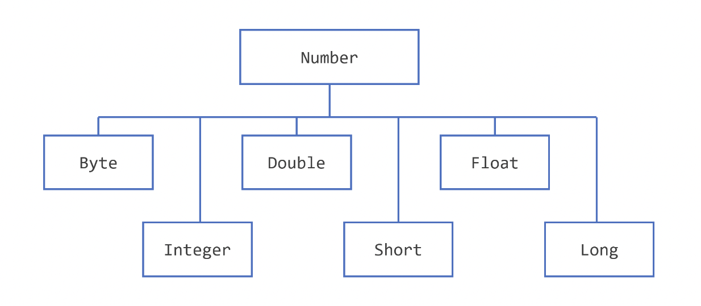

# Number class in Java

This section discusses briefly about the Number class in the java.lang package, its subclasses, and the situations where you would use instantiations of these classes rather than the primitive number types.

## Description

When working with numbers, most of the time you use the primitive types in your code for example:

```java
int i = 500;
float gpa = 3.65f;
byte mask = 0x7f;
```

There are, however, reasons to use objects in place of primitives, and the Java platform provides wrapper classes for each of the primitive data types.

All of the numeric wrapper classes are subclasses of the abstract class Number:



## Reasons to use Number class

Few reasons to use a Number object rather than a primitive:

-   As an argument of a method that expects an object (often used when manipulating collections of numbers).
-   To use constants defined by the class, such as MIN_VALUE and MAX_VALUE, that provide the upper and lower bounds of the data type.
-   To use class methods for converting values to and from other primitive types, for converting to and from strings, and for converting between number systems (decimal, octal, hexadecimal, binary).

## Number Methods

Some list of the instance methods that all the subclasses of the Number class implements

> The following methods convert the value of this Number object to the primitive data type returned.

```java
byte byteValue()
short shortValue()
int intValue()
long longValue()
float floatValue()
double doubleValue()
```

> The following methods compare this Number object to the argument.

```java
int compareTo(Byte anotherByte)
int compareTo(Double anotherDouble)
int compareTo(Float anotherFloat)
int compareTo(Integer anotherInteger)
int compareTo(Long anotherLong)
int compareTo(Short anotherShort)
boolean equals(Object obj)
```

## Conclusion

Normally, when we work with Numbers, we use primitive data types such as byte, int, long, double, etc. However, in development, we come across situations where we need to use objects instead of primitive data types. In order to achieve this, Java provides wrapper classes.

All the wrapper classes (Integer, Long, Byte, Double, Float, Short) are subclasses of the abstract class Number.

Converting primitive data types into object is called boxing, and this is taken care by the compiler. Therefore, while using a wrapper class you just need to pass the value of the primitive data type to the constructor of the Wrapper class.
