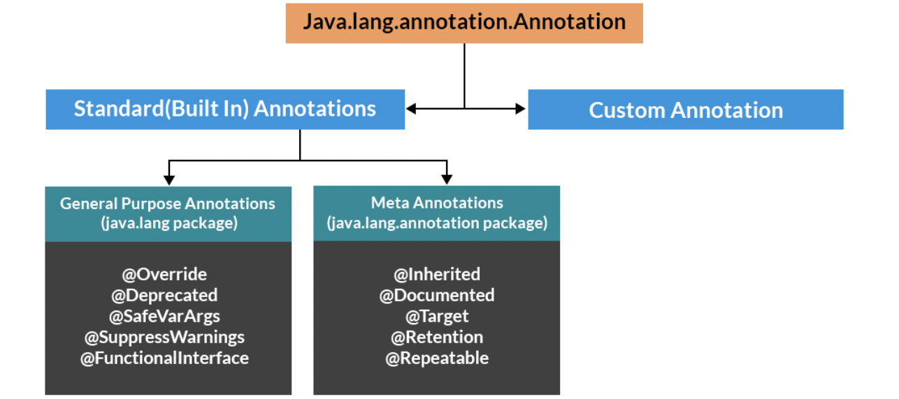

# Annotations in Java

This section explains briefly on where annotations can be used, how to apply annotations, what predefined annotation types are available in the Java.

### What are annotations?

Annotations can help other people who are reading your code understand what different parts of your code are for. Annotations are a way to add extra information to your code that can help make it easier to understand and use.

Annotations are used to provide supplemental information about a program.

-   Annotations start with ‘@’.
-   Annotations do not change the action of a compiled program.
-   Annotations help to associate metadata (information) to the program elements i.e. instance variables, constructors, methods, classes, etc.
-   Annotations are not pure comments as they can change the way a program is treated by the compiler.
-   Annotations basically are used to provide additional information.

### Hierarchy of Annotations in Java



<code><small>Image source: https://www.geeksforgeeks.org/annotations-in-java</small></code>

### The Format of an Annotation

In its simplest form, an annotation looks like the following:

```java
@Entity
```

The at sign character (@) indicates to the compiler that what follows is an annotation. In the following example, the annotation's name is Override:

```java
@Override
void mySuperMethod() { ... }
```

The annotation can include elements, which can be named or unnamed, and there are values for those elements:

```java
@Author(
   name = "Benjamin Franklin",
   date = "3/27/2003"
)
class MyClass { ... }

```

or

```java
@SuppressWarnings(value = "unchecked")
void myMethod() { ... }
```

If there is just one element named value, then the name can be omitted

### Categories of Annotations

-   Marker Annotations
-   Single value Annotations
-   Full Annotations
-   Type Annotations
-   Repeating Annotations

### Predefined Annotations in Java

A set of annotation types are predefined in the Java. Some annotation types are used by the Java compiler, and some apply to other annotations.

The predefined annotation types defined in java.lang are

-   @Deprecated,
-   @Override, and
-   @SuppressWarnings.

---

Reference

-   [https://www.geeksforgeeks.org/annotations-in-java](https://www.geeksforgeeks.org/annotations-in-java/)

-   [https://dev.java/learn/annotations](https://dev.java/learn/annotations/#using)
